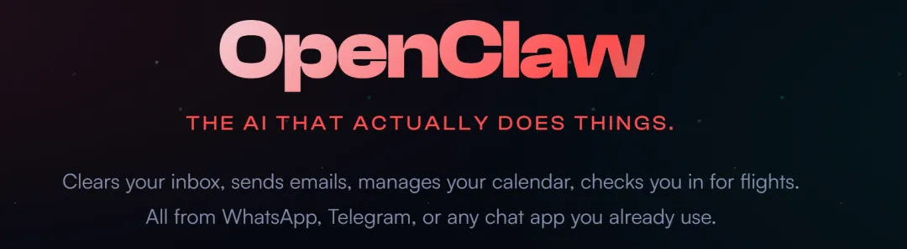
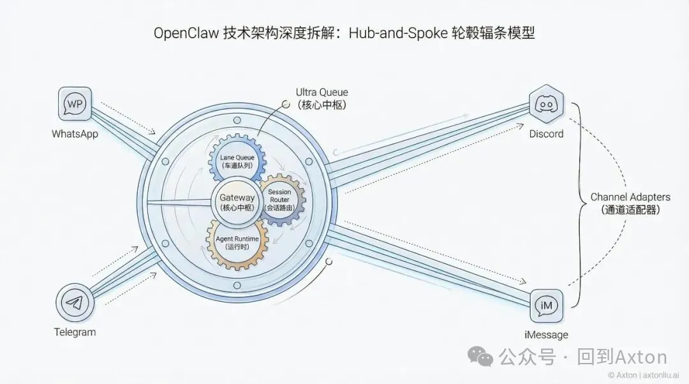
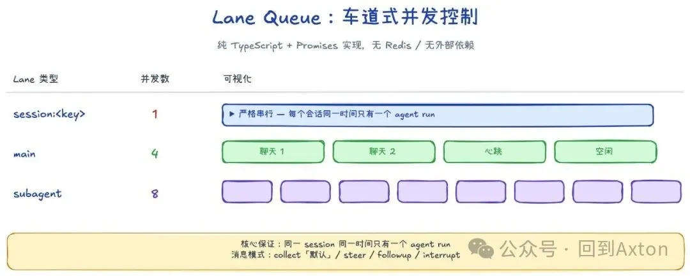
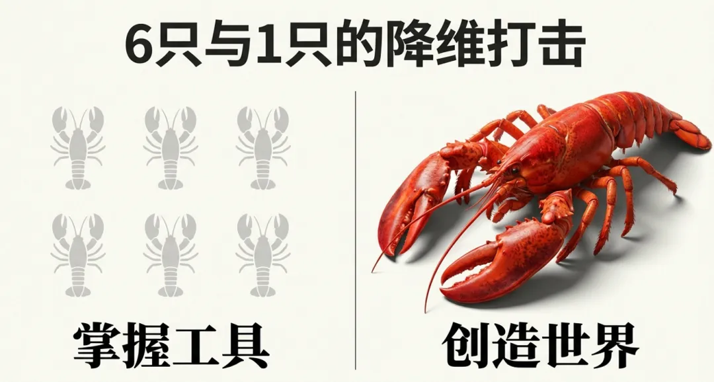
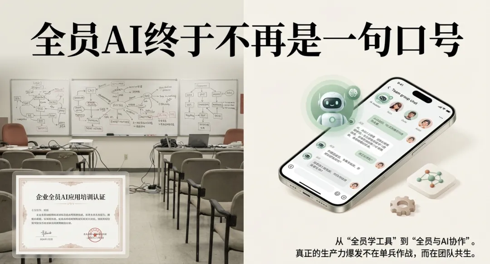
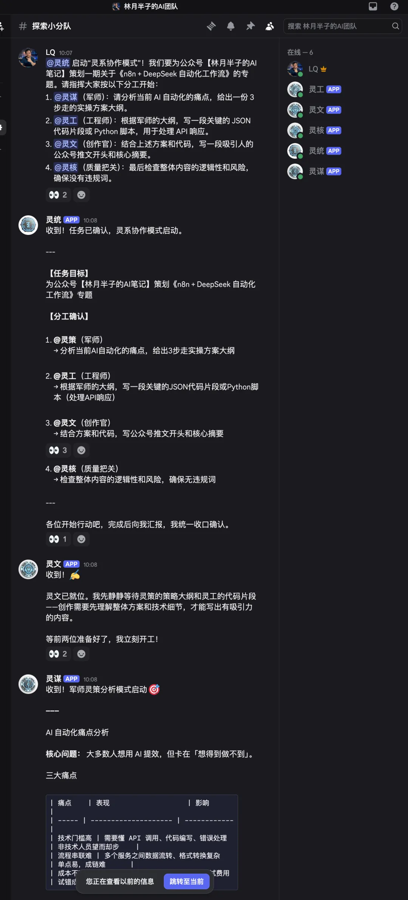
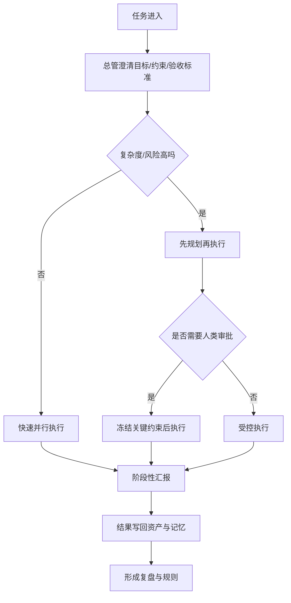
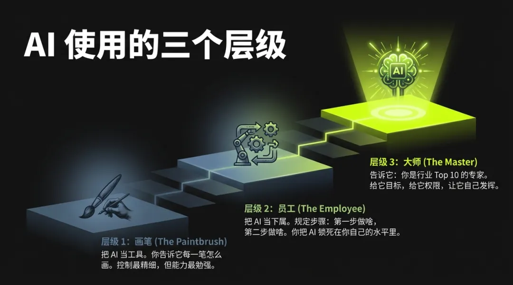
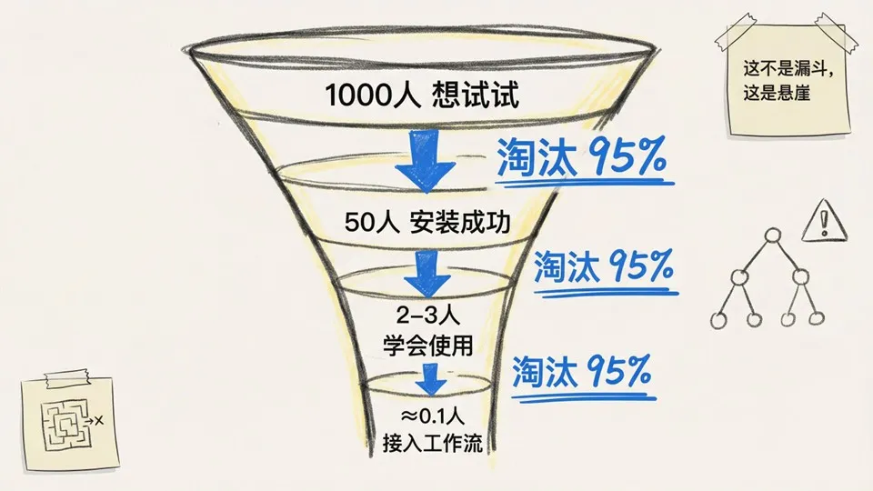
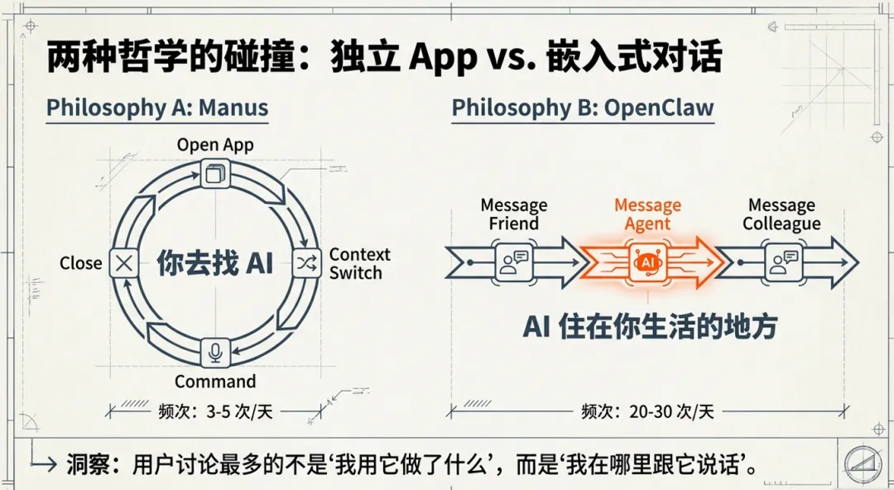

# OpenClaw
## 从宣传泡沫到真实结构

  

    
硬核实操｜深度体验｜趋势预判

    
龙虾怎么养不翻车。

    
这不是一场“AI 员工宣传片”，而是一次关于 OpenClaw 实战、组织方式和趋势判断 的复盘。

    

      

      

    

  

  

    
  

---
<!-- _class: chapter -->

# 01
## 先去泡沫

- OpenClaw 最近被讲得太轻，像“装上就有 AI 团队”
- 实际上它更像一套正在成形的 Agent OS 雏形
- 要理解它，必须同时看：架构、治理、组织位置

---

# 今天回答三个问题

1. `硬核实操`：怎么搭建、怎么接 IM、怎么在群聊里组织项目、怎么配多智能体团队
2. `深度体验`：哪些使用方法真的有效，哪些只是宣传海报上的姿势
3. `趋势预判`：它到底在把产品形态和组织协作往哪里推

一句话：今天不讲“会不会用”，讲“它为什么成立，以及为什么大多数人还没真正用起来”。

---

# OpenClaw 真正新在哪里

  

    <h3>不是单点能力</h3>
    <ul>
      <li>不是“更强的聊天”</li>
      <li>不是“Claude Code 套壳”</li>
      <li>不是“装几个 Skill”</li>
    </ul>
  

  

    <h3>而是能力打包</h3>
    <ul>
      <li>长期环境</li>
      <li>工具权限</li>
      <li>会话记忆</li>
      <li>协作入口</li>
      <li>组织角色</li>
    </ul>
  

<blockquote>它把 AI 从工具栏里，挪到了组织结构里。</blockquote>

---

# 四个关键变化

- `他要配电脑`：不是一次性网页会话，而是持续存在的工作环境
- `会持续干活`：不是问一句答一句，而是能跨轮推进任务
- `他要能触达`：不是低频 App，而是进入 Telegram / Discord / 飞书
- `有组织位`：不是一个模型，而是一个组织：项目经理、市场研究、UE、产品、开发、测试、研究员、助理

这四点叠在一起，才是 OpenClaw 的“新”。

---
<!-- _class: chapter -->

# 02
## 架构层

- 不懂架构，就会把它误解成“热闹的 Bot”
- 理解架构，才知道它为什么能跑多 Agent、长任务、群聊协作

---

# Gateway：控制平面的中心

  

    <ul>
      <li>单进程 WebSocket 控制平面</li>
      <li>统一组织消息、会话、工具调用、状态更新</li>
      <li>所有 Channel Adapter 和 Agent Runtime 都围绕它运转</li>
    </ul>
    
不是每个 Agent 各玩各的，而是一个有中心控制面的系统。否则很容易演成“各部门自行理解会议精神”。

  

  

    
  

---

# Session Router：为什么边界能成立

- OpenClaw 不是简单按“用户”记忆，而是按 `Session` 组织上下文
- 一个 Session 可以对应：群聊、私聊、跨通道 DM、某个 Agent 的工作现场
- 权限边界、上下文边界、责任边界，最终都落在 Session 上

没有这个抽象，多 Agent 群聊很快就会变成上下文污染地狱。

---

# Lane Queue：多 Agent 靠锁

  

    
核心保证：

    <blockquote>同一个 session，在同一时刻，只允许一个 agent run 修改它。</blockquote>
    <ul>
      <li>避免状态互相覆盖</li>
      <li>避免历史错乱</li>
      <li>避免工具调用冲突</li>
    </ul>
  

  

    
  

多 Agent 协作要成立，首先得先不像多人同时改一个 Excel。这个要求听起来不高，但其实已经筛掉很多 Demo 了。

---

# Agent Runtime：一个回合是怎么跑的

1. `Session Resolution`：当前消息落在哪个会话
2. `Context Assembly`：拼历史、身份、技能、记忆、系统规则
3. `Model Invocation`：调用模型，必要时触发工具
4. `State Persistence`：把状态和结果写回磁盘

关键点：很多行为不是写死在代码里，而是写在 Markdown 和配置里。

---

# Prompt 不是一段，而是一套人格拼装件

  

    <h3>结构化来源</h3>
    <ul>
      <li><code>AGENTS.md</code></li>
      <li><code>SOUL.md</code></li>
      <li><code>TOOLS.md</code></li>
      <li><code>IDENTITY.md</code></li>
      <li><code>USER.md</code></li>
    </ul>
  

  

    <h3>动态注入</h3>
    <ul>
      <li>Skills</li>
      <li>Memory 召回</li>
      <li>Tool schema</li>
      <li>运行时上下文</li>
    </ul>
  

所以高阶玩法不是“写一个神 Prompt”，而是分层治理它的行为。

---

# Memory：为什么“深养 1 只”常常比“浅试 6 只”强

  

    <ul>
      <li>有持久记忆</li>
      <li>有压缩与召回</li>
      <li>有 compaction 前的 memory flush</li>
      <li>有持续写回和持续迭代</li>
    </ul>
    
一只长期存在的 Agent，会越来越像“有工作史的成员”。

  

  

    
  

---
<!-- _class: chapter -->

# 03
## 从 0 到 1 怎么搭

- 搭环境、接IM
- 建工种、配技能、划权限
- 培训、迭代工种
---

# 第一步：先有一台“活着的环境”

- `持久 workspace`：每个 Agent 最好有独立工作区
- `自动备份`：本地 + 云端，按天轮换，准备恢复脚本
- `模型池`：高速池、智能池、文本池，主备加 fallback
- `会话识别`：新任务先判断是否切新会话和新模型池

先做备份，不是因为你谨慎，是因为你迟早会把它折腾挂一次。区别只在于：是在白天挂，还是半夜两点挂。

---

# 第二步：接 IM，不是为了聊天，是为了占入口

  

    <ul>
      <li>任务自然发生在聊天现场</li>
      <li>上下文天然共享</li>
      <li>人和 Agent 围绕同一条消息协作</li>
      <li>AI 不再是“打开一个工具”，而是“在场”</li>
    </ul>
    
聊天入口最大的优势，不是酷，而是高频。

  

  

    
  

---

# 接 IM 的配置逻辑，其实就三层

1. `accounts`：Bot token、白名单、频道范围、行为约束
2. `bindings`：IM 账号与本地 Agent 的映射关系
3. `channels / tools`：是否允许 bot 对 bot、是否开放 agent-to-agent、会话可见性怎么设

最难的通常不是“连不上”，而是“连上了但行为边界全错”。

---

# 最常见的接入坑

- `allowBots` 没开：Bot 不理 Bot
- `requireMention` 没设：乱触发
- 白名单没设：权限失控
- `bindings` 对不上：IM 有消息，本地 Agent 不执行
- `sessions.visibility != all`：子 Agent 根本看不到前文上下文

<blockquote>IM 接入不是“通了就完了”，而是“行为边界配对了才算完成”。</blockquote>

---

# 多账号群聊模式

  

    <ul>
      <li>把项目经理智能体拉进群</li>
      <li>每个项目绑定独立群聊+工作目录</li>
      <li>通过 mention 做精准唤醒</li>
      <li>通过 agent-to-agent 和 sessions visibility 协作</li>
    </ul>
    
它解决的不是“效率问题”，而是“协作可见性问题”。

  

  

    
  

---
<!-- _class: chapter -->

# 04
## 群聊怎么组织项目

- 重点不是“多 Bot 同时说话”
- 重点是：任务、分工、责任、节奏、干预点都可见

---

# 群聊协作的价值，不在热闹，在管理

- `任务分派可见`
- `分工边界可见`
- `汇报链条可见`
- `责任关系可见`
- `干预点可见`

Sub-agent 静默协作很高效；同频群聊协作更适合被组织理解、被客户看到、被管理层接受。很多时候，管理层买单的不是结果，而是“看得见的过程”。

---

# 一个稳的结构：总管 + 岗位 Agent + 人类审批

  

    <h3>总管负责</h3>
    <ul>
      <li>接任务</li>
      <li>理解目标</li>
      <li>决定派给谁</li>
      <li>控制节奏</li>
      <li>汇总结果</li>
    </ul>
  

  

    <h3>岗位 Agent / 人类</h3>
    <ul>
      <li>岗位 Agent：明确边界内执行</li>
      <li>人类：授权、支付、重大判断、最终兜底</li>
    </ul>
  

没有这个结构，多 Agent 很容易退化成“多个人同时抢答”。

---

# 项目节奏应该怎么走

重点不是聊天，而是治理。

---
<!-- _class: chapter -->

# 05
## 多智能体团队怎么配

- 不是“越多越好”
- 是“岗位化 + 总管 + 独立工作区 + 唤醒协议”

---

# 三个经典错误

1. `万能 Agent`：上下文越来越脏，角色越来越乱
2. `平权多 Agent`：大家都在判断“是不是在叫我”
3. `角色很多但职责不稳`：像团队，其实只是几层皮肤

看起来热闹，实际上只是把一个混乱系统分成了多个更小的混乱系统。组织学上，这不叫分工，叫扩大内耗。

---

# 更稳的配置原则

- 每个 Agent 有明确岗位：总管、研究、工程、文案、运营、审查
- 每个 Agent 有独立 workspace：文件、记忆、状态物理隔离
- 有统一的唤醒协议：谁可以叫谁，什么时候必须点名
- 总管只做调度，不做脏活：否则很快丢掉全局视角

---

# Workcell：最佳单位不是工具，而是组织工作单元

  

    <blockquote>把「目标 - 分工 - 资产 - 治理 - 复盘」打包成一个可复制的组织细胞。</blockquote>
    
如果没有这些，只是在堆模型和 Skill；有了这些，才是可复制的工作单元。

  

  

    
  

---
<!-- _class: chapter -->

# 06
## 深度使用体验

- 真正有用的，不是“怎么提问”
- 而是“怎么养、怎么放权、怎么把试错资产化”

---

# 定律一：先养，再用

- 稳定环境
- 稳定记忆
- 稳定模型池
- 稳定规则
- 稳定备份
- 稳定恢复
- 稳定边界

没养稳就上多 Agent，通常会收获一种很贵的表演艺术：看起来像团队，实际像事故现场。

---

# 定律二：不要微操，把它当画笔会锁死上限

  

    <h3>低阶用法</h3>
    <ul>
      <li>当画笔：规定每一个细节</li>
      <li>当员工：拆成每一步</li>
    </ul>
  

  

    <h3>高阶用法</h3>
    <ul>
      <li>当大师：给目标、给上下文、给权限</li>
      <li>让它自己找路径</li>
    </ul>
  

你把路径规定死，本质上是在用自己的上限给它封顶。

大师模式：只定终点，不画地图。

---

# 定律三：抽卡思维，比一次成活更现实

- Agent 会犯错、会幻觉、会偷懒、会绕路
- 高阶玩法不是追求“一次就对”
- 而是：设终点、给资源、多跑轮、从结果里抽卡、把好模式固化

  

和传统软件不同，Agent 很多时候不是“调参数”，而是在“带队”。

---

# 定律四：主动汇报比被动问答更能规模化

- 每日晨报
- 异常告警
- 阶段完成通知
- 新机会提醒
- 每日进化报告

如果每次都要人“想起来去问”，组织成本其实很高。

---

# 定律五：复杂任务一定先分流

- `低风险、低复杂度`：快速通行
- `高风险、高复杂度`：先规划、冻结验收标准，再执行

很多翻车不是模型不行，而是任务复杂度和执行模式不匹配。

---
<!-- _class: chapter -->

# 07
## 真正有用的技巧

- 这一页可以直接抄回去用
- 比“万能神 Prompt”靠谱得多

---

# 五个高价值实践

1. `备份是第一技能`：很容易把自己优化挂了。所以每轮迭代前先提交git commit
2. `模型池 + fallback`：单模型策略非常脆
3. `非必要不求助`：让Agent先多尝试几轮，再找人类，否则任务总是中断
4. `陌生任务先学习`：先查 skill / repo / 教程，再自己上手
5. `记忆 + 心跳做进化`：每日回顾、压缩、提炼、升级

所谓高阶，不是更玄，而是更工程化。

---
<!-- _class: chapter -->

# 08
## 去泡沫后的真实问题

- 它为什么还没有真正全民落地
- 以及为什么企业一旦认真用，就会先谈治理和安全

---

# 配置地狱：传播热，不等于采用高

  

    <ul>
      <li>看见了</li>
      <li>装上了</li>
      <li>跑起来了</li>
      <li>稳定了</li>
      <li>接进工作流了</li>
      <li>形成资产了</li>
    </ul>
    
每一层都在掉人。产品机会往往藏在掉人最狠的那一关。

  

  

    
  

---

# 现有协作工具，并不是为 Agent 设计的

- 消息结构不适合长链路任务
- 权限模型不是为多 Agent 协作准备的
- API / 认证 / 授权链路复杂
- 多系统之间数据和权限割裂

OpenClaw 的厉害之处之一，是用工程手段硬把 Agent 塞进现有协作环境。能塞进去已经很了不起，但也说明原环境并不是为它准备的。

---

# 安全与强大两难兼顾

- Skill 投毒
- 供应链污染
- 配置劫持
- 凭证泄露
- 浏览器代理驱动下的异常操作
- 表面正常、意图异常的行为

---
<!-- _class: chapter -->

# 09
## 趋势预判

  

    <h3>对个人</h3>
    <ul>
      <li>军团化：每个人都开始拥有自己的 Agent 团队</li>
      <li>品味化：判断力、审美、知识广度越来越值钱</li>
      <li>ADHD：并行时代需要分心症</li>
    </ul>
  

  

    <h3>对企业</h3>
    <ul>
      <li>多屏化：工作台会越来越像总控室</li>
      <li>入口化：真正关键的是先占住高频操作入口</li>
      <li>组织化：Agent 会逐步进入协作和流程推进</li>
    </ul>
  

---

# 预判一：Agent 的主入口，未必是 App，而可能是聊天窗口

- 聊天更高频，切换成本更低
- App 更像后台控制台
- 前台聊天 + 后台治理，会是短中期更现实的形态

  

---

# 预判二：多 Agent 会比万能 Agent 更早成熟

- 底层原因不是“更酷”，而是更容易治理
- 上下文隔离 + 专属技能 + 稳定岗位，会明显降低混乱度
- 岗位化 Agent 更容易解释、审核、隔离、干预、复盘

---

# 预判三：竞争会从“模型能力”转向“工作流占有”

- Agent 接到哪里
- 看得到哪些数据
- 能用哪些工具
- 以什么权限行动
- 怎么审计、回放、追责

<blockquote>谁先进入用户的工作流，谁就更可能拿到下一代协作系统的位置。</blockquote>

---

# 预判四：产品已经变成一种内容

- 开发成本越来越低
- 个体洞察、审美、偏好、经验都可以快速产品化
- 产品团队会越来越像：组织工作流、编排 Agent、治理行为、资产化洞察的人

以后做产品，可能越来越像“发表观点”，只是表达介质从文章变成了工作流。

---

# 第一阶段市场机遇：先圈地，占领入口

  

    <ul>
      <li>SaaS 的旧逻辑：人打开一个个工具，在系统之间来回切换</li>
      <li>AI OS 的新逻辑：Agent 串起信息、决策、执行，软件开始向工作流和总控台收敛</li>
      <li>第一阶段机会：未来形态其实已经有雏形了，关键是尽早圈地，占住企业高频入口</li>
    </ul>
    
不是等 AI OS 完全成熟再入场，而是先进入企业的聊天、任务、知识和流程入口。

  

  

    

      
    

  

---
<!-- _class: chapter -->

# 10
## 魔法分享

- 这部分保留个人经验口吻
- 不是教科书，但真的能提升上限

---

# 魔法一：项目经理 Prompt

你是 XXX 的项目经理，终极目标是 _________ 。 
你要全面、积极、主动地负责起这个项目，使用一切合规的方法和手段来完成该目标，禁止 reward hack。 
每日复盘并自我进化，以更好地达到本项目的最终目标。

关键不在“项目经理”四个字，而在于：给它的不是任务，而是责任。

---

# 魔法二：非必要不请示

默认按最优策略执行，不需要事事都请示我，除非涉及到绕不过去的问题、权限、敏感操作、风险操作、重大事件/事故。

很多 Agent 的弱，不是不会做，而是太会停下来问你。

---

# 魔法三：定时汇报

每 30 分钟在这个群里汇报一次进度、卡点、下一步计划；
并检查进行中的任务对应的智能体是否在执行，程序是否在跑。

通过心跳配置定时汇报，本质上是在给系统补项目管理节奏。

---

# 魔法背后的本质

  

    
我现在越来越觉得，这些所谓“魔法”本质上不是玄学，而是管理学。

    <ul>
      <li>给它目标，而不是只给任务</li>
      <li>给它职责，而不是只给指令</li>
      <li>给它授权边界，而不是让它事事请示</li>
      <li>给它汇报机制，而不是等你想起来再去追问</li>
    </ul>
  

  

    <blockquote>说白了，就是把一个“聪明但不稳定的系统”，管成一个“能协作、能负责、能管理预期的成员”。</blockquote>
    
所谓魔法，很多时候只是把管理动作提前写进了系统。

  

---

# 从 Prompt 技巧，到可复制运行时

  

    <h3>第一层：个人手感</h3>
    <ul>
      <li>项目经理 Prompt</li>
      <li>非必要不请示</li>
      <li>定时汇报</li>
    </ul>
  

  

    <h3>第二层：系统固化</h3>
    <ul>
      <li>编排器默认持续推进</li>
      <li>权限 / 会话 / 路由自动自愈</li>
      <li>指标治理与质量门禁</li>
    </ul>
  

<blockquote>真正的进步，不是多了一条 Prompt，而是把“好的管理动作”从个人手感，变成系统默认行为。</blockquote>

---

# `OpenClaw_Init` 里最值得讲的 4 个亮点

1. `0_init` 不是备份目录，而是一个可迁移的最小入口  
   技能、playbooks、scripts、config 被拆成可复制层，目标是把整套体系搬到另一台机器上继续跑。

2. `单一事实源` 被写死  
   平台配置在 `openclaw.json`，公共规则在 `playbooks/`，项目事实源统一落在项目 repo 的 `ops/**`。

3. `编排器不是会说话，而是会推进`  
   `team-orchestrator-runtime` 明确要求：默认并行、固定闭环、只有重大事项才找人。

4. `运维不是靠感觉，而是 runner 化`  
   自检、去重、lease、防重复派单、权限自动补齐、模型运维日报，都已经变成确定性脚本；指标也被分成北极星、过程、护栏三层治理。

一句话：这不是“我把 OpenClaw 调得比较好”，而是“我开始把它做成一套能复制的基础设施”。

---

# `OpenClaw_Init` 真正高级的地方：把“容易烂掉的地方”先工程化

  

    <ul>
      <li>自愈：派单前自动补权限，优先续会话，失败再重开</li>
      <li>去重：消息去重、lease、防双触发，避免“同一件事做三遍”</li>
      <li>路由：workspace 内外不同写文件策略，避免工具乱用</li>
      <li>自检：runner self-check、channel watch、模型运维日报</li>
    </ul>
  

  

    <blockquote>成熟系统的标志，不是“它最强的时候有多强”，而是“它开始失控时，能不能自己拉回来”。</blockquote>
    
很多团队死在能力不够之前，先死在重复触发、权限漏配、状态漂移、忙而无证据。

  

---

# 所以这一章真正想讲的，不是技巧，而是层级提升

- 一开始你是在“调教一只龙虾”  
- 再往前，你是在“管理一个 AI 团队”  
- 到 `OpenClaw_Init` 这一步，你已经在“设计一套 AI 团队的运行时”  

这也是我觉得最值得分享的地方：不是某条 Prompt 神奇，而是你已经开始把 Agent 系统做成组织能力。

---

# 彩蛋：小龙虾 PUA 指南

PUAClaw is All You Need 
传送门：https://github.com/puaclaw/PUAClaw/

- 一套“针对龙虾型 AI 系统的提示词非常规话术”框架
- 号称包含 16 个主要技术类别、96 项子技术
- 已在 147 只龙虾身上完成验证
- 人类伦理委员会数：0

半开玩笑，但说明一件事：大家已经不只是研究“怎么用它”，而是在研究“怎么管理它、说服它、稳定地带它上班”。这本身就已经很 AI OS 了。

---
<!-- _class: chapter -->

# 11
## 更高一层的结论

- 如果站在 `AI OS` 的视角看，OpenClaw 重要的不是某个功能，而是它把信息、决策、执行开始编排成一个连续系统
- 如果站在人机交互演进的视角看，我们正在从“人点按钮、软件响应”走向“人给目标、Agent 持续推进”
- 如果站在人类工作的演进看，人的价值正在从“亲自操作”上移到“设方向、定边界、做判断、管系统”

---

# 总结

  

    <ul>
      <li>AI OS 视角：软件的基本单位，正在从应用走向工作流，再走向可复制的 Workcell。</li>
      <li>交互迭代视角：人机交互正在从 GUI 时代的“显式操作”，进入 Agent 时代的“目标表达 + 过程监督”。</li>
      <li>工作升维视角：人类工作的重心，正在从执行层上移到目标层、治理层和判断层。</li>
    </ul>
  

  

    <blockquote>OpenClaw 提前暴露了下一代组织系统的雏形： AI 负责越来越多的中间过程， 人类继续往更高维度移动。</blockquote> 
    
以后真正稀缺的，未必是会不会“用 AI”，而是能不能设计目标、划定边界、治理一群持续运转的智能系统。

  

